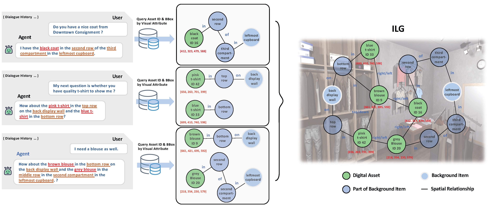
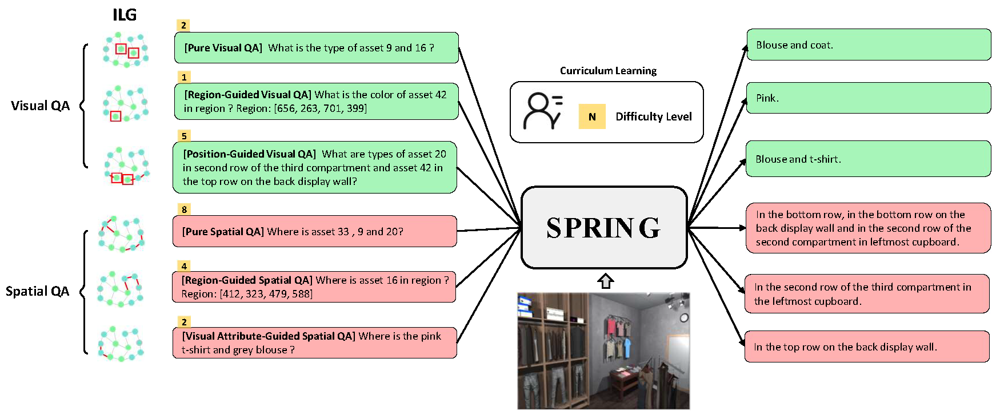

# SPRING

    
    
    
     

## 🏴 **Overview**
we propose a [Situated Conversation Agent Pre-trained with Multimodal Questions from Incremental Layout Graph](https://arxiv.org/abs/2301.01949) (SPRING) with abilities of reasoning multi-hops spatial relationships and connecting them with visual attributes in crowded situated scenarios. Specifically, we design two types of Multimodal Question Answering (MQA) tasks to pretrain the agent. All QA pairs utilized during pretraining are generated from novel Increment Layout Graphs (ILG). QA pair difficulty labels automatically annotated by ILG are used to promote MQA-based Curriculum Learning. Experimental results verify the SPRING’s effectiveness, showing that it significantly outperforms state-of-the-art approaches on both SIMMC 1.0 and SIMMC 2.0 datasets.

## 🔥 News
- 2023.1.31: Code has been submitted to Security Department for check, which will be released in two weeks. You are welcome to star our project for latest update!
- 2023.1.5: Our paper is announced as AAAI 2023 Oral.
- 2022.11.18: Our paper is accepted by AAAI 2023 Main Track. 

## 📝 **License**

Our repository is released under MIT License, see [LICENSE](LICENSE) for details.
